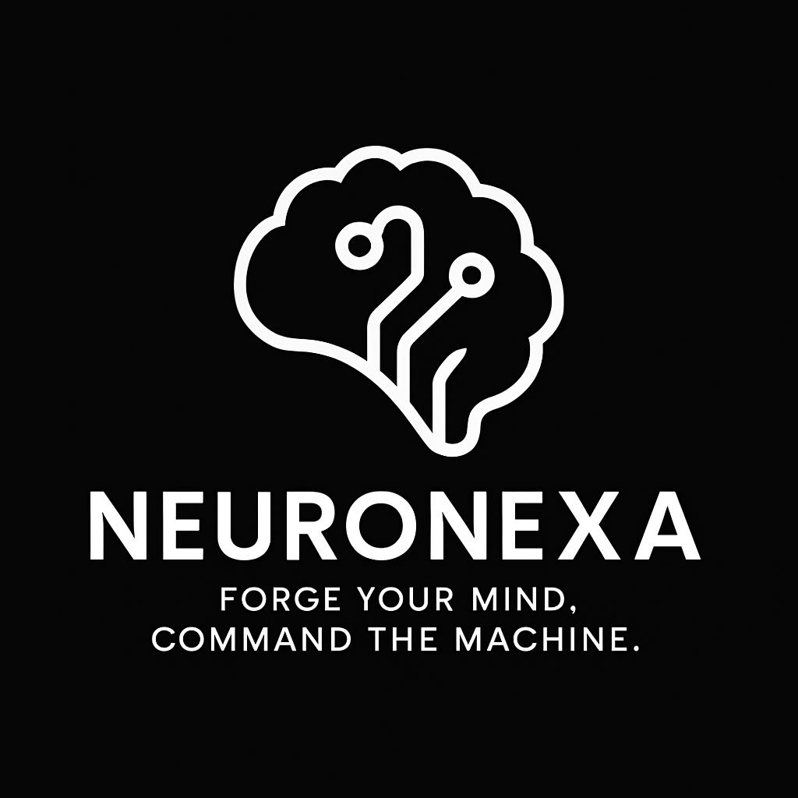

# 🧠 NeuroNexa – Where Thought Becomes Command



**NeuroNexa** is an elite prompt arsenal and dark-themed AI command interface. This static landing page is built for creators, coders, and power-communicators who want to **dominate AI**, not just interact with it.

---

## ⚡ What It Offers

- 🔐 **100+ Black-ops Prompts**  
  For coding, manipulation, storytelling, automation & KDP publishing.

- 🧠 **Command-Line Mindset**  
  Don’t ask. **Command**. NeuroNexa teaches you to speak in prompt code.

- 🛠️ **Tools to Launch AI Businesses**  
  Turn prompts into income streams with pre-built, deploy-ready tools.

---

## 🚀 Tech Stack

- [Next.js](https://nextjs.org/) – Static Export Mode  
- [TailwindCSS](https://tailwindcss.com/) – Custom dark UI  
- [Lucide Icons](https://lucide.dev/) – Clean, scalable SVGs  
- Fully responsive, animated radial gradient background  
- Optimized for SEO & social preview cards

---

## 🔧 Setup & Deploy (Local & Netlify)

```bash
npm install
npm run build
npm run export
